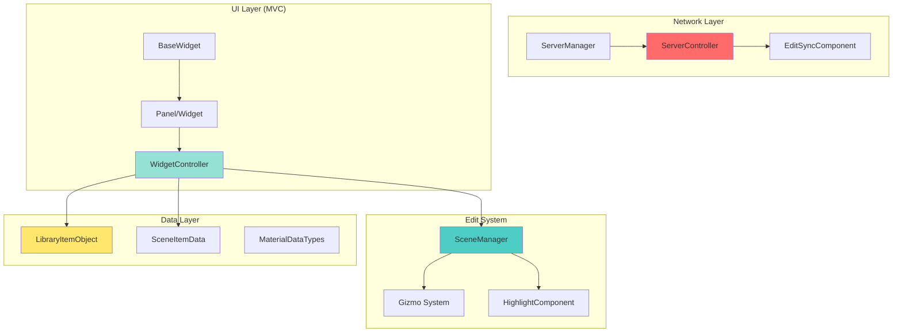

# ThirdMotion

<div align="center">


**멀티플레이어 기반 협업 3D 편집 툴**

[개요](#-project-overview) • [기능](#-core-features) • [아키텍처](#-architecture) • [설치](#-getting-started)

</div>

---

## 📋 Project Overview

ThirdMotion은 Unreal Engine 5.6 기반의 실시간 협업 3D 편집 툴입니다. 여러 사용자가 동시에 접속하여 3D 씬을 구성하고, Actor/Mesh/Material/Light/Camera를 편집할 수 있는 멀티플레이어 환경을 제공합니다.

<table>
  <tr>
    <td><strong>개발 기간</strong></td>
    <td>2025.10.21 - 2025.11.03 (14일)</td>
  </tr>
  <tr>
    <td><strong>팀 구성</strong></td>
    <td>4명 (eunjung, HyeseonLikesPizza/Lauren, bsj, heekki2024)</td>
  </tr>
  <tr>
    <td><strong>엔진 버전</strong></td>
    <td>Unreal Engine 5.6</td>
  </tr>
  <tr>
    <td><strong>개발 언어</strong></td>
    <td>C++ & Blueprint</td>
  </tr>
  <tr>
    <td><strong>총 커밋 수</strong></td>
    <td>145 commits</td>
  </tr>
</table>

---

## ✨ Core Features

### 🌐 멀티플레이어 협업
- **Steam Session 기반 호스팅**: Host/Join 방식의 멀티플레이어 세션
- **실시간 동기화**: Actor 스폰, 트랜스폼, 메시/머티리얼 변경 실시간 동기화
- **Voice Chat**: Steam Voice Chat을 통한 음성 통신
- **User List**: 접속 중인 사용자 목록 실시간 표시

### 🎨 3D 편집 시스템
- **Library Panel**: 카테고리별 Preset 관리 (Furniture, Light, Camera, Mesh)
- **Preview Ghost**: 배치 전 미리보기 기능
- **Runtime Gizmo**: Location/Rotation/Scale 3가지 편집 모드
- **Align Mode**: World/Local 좌표계 전환
- **Actor Highlight**: 선택된 액터 강조 표시
- **XYZ Panel**: 수치 입력을 통한 정밀 트랜스폼 조정

### 💡 Light 시스템
- **4가지 Light Type**: Directional, Point, Spot, Rect Light
- **Light Preset Library**: 사전 정의된 라이트 템플릿
- **실시간 속성 조정**: Intensity, Color, Angle, Attenuation 등

### 🎥 Camera 시스템
- **자유로운 카메라 이동**: WASD + QE 키보드 조작
- **마우스 시점 회전**: RMB 드래그로 시점 회전
- **다각도 View 전환**: Front/Back/Top/Bottom/Left/Right 빠른 전환

### 🎭 Material & Mesh 시스템
- **Color Picker**: 실시간 색상 선택 및 머티리얼 생성
- **Material Preview**: 자동 생성되는 머티리얼 썸네일
- **Mesh/Material Combo**: 드롭다운을 통한 빠른 변경
- **Material Data Table**: 체계적인 머티리얼 데이터 관리

### 💾 파일 시스템
- **Save/Load**: SaveGame을 통한 씬 저장/불러오기
- **Scene List**: 배치된 Actor 목록 및 필터링
- **Actor 관리**: 선택, 삭제, 속성 편집

### 📝 Memo 시스템
- **협업 메모**: 팀원과 공유 가능한 메모 기능
- **Persistent 저장**: 씬과 함께 저장/불러오기

---

## 🏗 Architecture

### 시스템 구조



### 주요 컴포넌트

#### Framework
- `ThirdMotionGameMode`: 게임 모드 관리
- `ThirdMotionPlayerController`: 플레이어 입력 및 카메라 제어
- `ThirdMotionGameInstance`: 전역 게임 상태 관리

#### Edit System
- `SceneManager`: 씬 내 Actor 관리 및 선택 처리
- `AssetResolver`: 에셋 경로 및 리소스 해결
- `HighlightComponent`: 선택된 Actor 강조 표시
- `EditSyncComponent`: 네트워크 동기화 컴포넌트
- `PreviewImageGenerator`: 머티리얼 썸네일 생성
- `LightEditLibrary`: Light 편집 유틸리티

#### Network
- `ServerController`: RPC 호출 및 서버 로직 처리
- `ServerManager`: 멀티플레이어 세션 관리

#### UI (MVC Pattern)
**Controllers:**
- `BaseWidgetController`: 모든 컨트롤러의 기본 클래스
- `LibraryWidgetController`: Library Panel 로직
- `MeshWidgetController`: Mesh/Material 변경 로직
- `XYZWidgetController`: 트랜스폼 수치 입력 로직
- `LightController`: Light 속성 편집 로직
- `SceneController`: Scene List 관리
- `ViewportController`: Viewport 상호작용
- `TopBarController`, `BottomController`, `RightPanelController`: UI 패널 로직

**Panels:**
- `TopBar`: 파일 메뉴, Gizmo 모드, User List
- `BottomBar`: Scene/View/Materials/Memo 탭 전환
- `RightPanel`: Properties 패널 (Actor별 동적 구성)
- `LibraryPanel`: Preset Library
- `MaterialGeneratePanel`: 머티리얼 생성 및 관리

**Widgets:**
- `MainWidget`: 메인 UI 컨테이너
- `ViewportWidget`: 3D 뷰포트 통합
- `LightWidget`: Light 속성 편집 UI
- `XYZWidget`: 트랜스폼 수치 입력 UI
- `MemoWidget`: 메모 작성 UI
- `SceneListWidget`, `UserList`: 리스트 표시 위젯

#### Data
- `LibraryItemObject`: Library Preset 데이터
- `SceneItemData`: 씬 내 Actor 데이터
- `MaterialDataTypes`: 머티리얼 데이터 구조
- `FileDataModel`: 파일 저장/불러오기 데이터

#### Save System
- `SaveGameManager`: 저장/불러오기 관리
- `ThirdMotionSaveGame`: SaveGame 데이터 구조

---

## 📁 Project Structure

```
ThirdMotion/
├── Source/ThirdMotion/
│   ├── Public/
│   │   ├── Framework/           # 게임 모드, 플레이어 컨트롤러
│   │   ├── Edit/                # 씬 편집 시스템
│   │   ├── Network/             # 네트워크 동기화
│   │   ├── UI/
│   │   │   ├── Panel/          # UI 패널 (TopBar, BottomBar, etc.)
│   │   │   ├── Widget/         # UI 위젯
│   │   │   │   ├── Library/   # Library 관련 위젯
│   │   │   │   └── Mesh/      # Mesh 관련 위젯
│   │   │   └── WidgetController/ # MVC 컨트롤러
│   │   ├── Data/               # 데이터 타입 및 구조체
│   │   └── Save/               # 저장/불러오기
│   └── Private/                # 구현 파일 (.cpp)
├── Content/
│   ├── Blueprints/             # Blueprint 에셋
│   ├── UI/                     # UMG 위젯 블루프린트
│   ├── DataTables/             # 데이터 테이블
│   └── Maps/                   # 레벨 맵
└── ThirdMotion.uproject        # 프로젝트 파일
```

---

## 🚀 Getting Started

### 시스템 요구사항

- **Unreal Engine**: 5.6 이상
- **Visual Studio**: 2022 (C++ 개발 환경)
- **OS**: Windows 10/11 64-bit
- **RAM**: 16GB 이상 권장
- **Storage**: 50GB 이상 여유 공간

### 설치 방법

1. **레포지토리 클론**
   ```bash
   git clone https://github.com/HyeseonLikesPizza/ThirdMotion.git
   cd ThirdMotion
   ```

2. **프로젝트 파일 생성**
   - `ThirdMotion.uproject` 우클릭 → "Generate Visual Studio project files"

3. **프로젝트 빌드**
   - `ThirdMotion.sln` 열기
   - Development Editor 구성으로 빌드

4. **프로젝트 실행**
   - Unreal Editor에서 `ThirdMotion.uproject` 열기

### 멀티플레이어 테스트

1. **Host 세션**
   - 메인 메뉴에서 "Host" 클릭
   - MainMap 로드 대기

2. **Join 세션**
   - 다른 인스턴스에서 "Join" 클릭
   - 세션 목록에서 선택 후 접속

3. **협업 편집**
   - Library에서 Preset 드래그 앤 드롭
   - Gizmo로 위치/회전/스케일 조정
   - 다른 클라이언트에서 실시간 동기화 확인

---

## 🎯 주요 기능 사용법

### Actor 배치하기
1. 왼쪽 Library Panel에서 카테고리 선택
2. 원하는 Preset 드래그
3. 뷰포트에서 배치 위치 클릭
4. Preview Ghost로 미리보기 후 확정

### Gizmo 사용하기
1. 배치된 Actor 클릭하여 선택
2. TopBar에서 Gizmo 모드 선택 (Location/Rotation/Scale)
3. Align Mode 전환 (World/Local)
4. Gizmo 핸들 드래그하여 조정

### Material 변경하기
1. Actor 선택 후 RightPanel의 Properties 확인
2. Material Combo Box에서 원하는 머티리얼 선택
3. 또는 Color Picker로 새 머티리얼 생성

### Light 배치하기
1. Library에서 Light 카테고리 선택
2. Light Type 선택 (Directional/Point/Spot/Rect)
3. 배치 후 Properties에서 Intensity, Color 조정

### 씬 저장/불러오기
1. TopBar의 File 메뉴 → Save 클릭
2. 씬 이름 입력 후 저장
3. Load에서 저장된 씬 목록 선택하여 불러오기

---

## 👥 Team & Contributions

<table align="center">
  <tr>
    <th>개발자</th>
    <th>역할</th>
    <th>커밋 수</th>
  </tr>
  <tr>
    <td><strong>eunjung</strong></td>
    <td>UI/UX, Light System, Voice Chat, Memo</td>
    <td>80</td>
  </tr>
  <tr>
    <td><strong>HyeseonLikesPizza/Lauren</strong></td>
    <td>Core System, Gizmo, Network, Camera</td>
    <td>54</td>
  </tr>
  <tr>
    <td><strong>bsj</strong></td>
    <td>Material System, Color Picker, Preview</td>
    <td>11</td>
  </tr>
</table>

### 상세 역할 분담

**eunjung (UI/UX Lead)**
- TopBar/BottomBar/RightPanel UI 디자인 및 구현
- Light System 및 Light Widget 구현
- Voice Chat 통합 (Steam Voice Plugin)
- Memo System 구현
- User List 및 접속자 관리
- Widget 디자인 및 아이콘 제작

**HyeseonLikesPizza/Lauren (Core System Lead)**
- Gizmo System 구현 (Location/Rotation/Scale)
- Scene Manager 및 Actor 선택 시스템
- Library Panel 및 Preset 시스템
- Mesh/Material 변경 시스템
- 카메라 조작 (WASD, View 전환)
- 네트워크 동기화 구조
- XYZ Panel 구현
- Library Preset 에셋 추가

**bsj (Material System)**
- Material Generate Panel 구현
- Color Picker 구현
- Preview Image Generator
- Material Detail Panel

---

## 📊 Development Timeline

### Week 1: 2025.10.21 - 10.24 (프로토타입)
- 프로젝트 초기 설정 및 구조 설계
- 서버 Listen 구축 및 멀티플레이어 기반 확립
- Edit Subsystem 기본 뼈대
- Library Panel 카테고리 시스템
- Actor 스폰 파이프라인 구현

### Week 2: 2025.10.25 - 10.31 (알파)
- Gizmo System 구현 (Location/Rotation/Scale)
- TopBar/BottomBar UI 디자인
- Actor Highlight 시스템
- 카메라 WASD + View 전환
- Material Panel 및 Color Picker
- Light Preset 시스템
- Mesh/Material 변경 시스템

### Final Phase: 2025.11.01 - 11.03 (베타)
- XYZ Panel 수치 입력 구현
- Light Widget 완성
- Memo System 구현
- Voice Chat 통합
- Material Preview 이미지 생성
- Scene List 필터링/삭제
- Properties 패널 동적 구성
- 네트워크 동기화 안정화
- 최종 통합 및 버그 수정

---

## 🔧 Technical Highlights

### MVC Pattern 구현
```cpp
// BaseWidget: View 레이어
class THIRDMOTION_API UBaseWidget : public UUserWidget
{
    UPROPERTY()
    UBaseWidgetController* WidgetController;
};

// BaseWidgetController: Controller 레이어
class THIRDMOTION_API UBaseWidgetController : public UObject
{
    // 비즈니스 로직 처리
};
```

### 네트워크 동기화
```cpp
// ServerController: RPC 관리
UFUNCTION(Server, Reliable)
void Server_SpawnActor(FActorSpawnData SpawnData);

// EditSyncComponent: Actor별 동기화
UPROPERTY(ReplicatedUsing = OnRep_Transform)
FTransform ReplicatedTransform;
```

### Runtime Gizmo
- TransformGizmo Component 활용
- World/Local 좌표계 전환
- 3가지 편집 모드 (Location/Rotation/Scale)

### Material Preview
- Scene Capture Component로 렌더링
- Runtime Texture 생성
- ComboBox에 썸네일 표시

---

## 🎓 Lessons Learned (KPT)

### 🟢 KEEP (잘한 점)

- **명확한 역할 분담**: UI, Core System, Material로 분업하여 병렬 작업 효율 극대화
- **MVC 패턴 준수**: BaseWidget/Controller 구조로 유지보수성 향상
- **Git 브랜치 전략**: 개인 브랜치(Lauren/CEJ/BSJ)로 독립 작업 후 main 머지
- **빈번한 커밋**: 평균 10+ 커밋/일로 작업 진행 상황 투명하게 관리
- **데이터 테이블 활용**: Library/Material/Mesh 데이터를 DT로 관리하여 확장성 확보
- **네트워크 레이어 분리**: ServerController/ServerManager로 깔끔한 네트워크 로직 분리

### 🟡 PROBLEM (어려웠던 점)

- **네트워크 동기화 복잡도**: RPC 호출 순서 보장 어려움, 일부 동기화 지연 발생
- **BP-C++ 혼재**: 로직은 C++, UI는 BP로 분리했으나 디버깅 시 추적 어려움
- **초기 기획 변경**: 개발 중 요구사항 변경으로 리팩토링 필요 (Properties 패널 구조)
- **Hot Reload 불안정**: C++ 코드 수정 후 전체 리빌드가 필요한 경우 발생

### 🔵 TRY (시도했으나 미완성)

- **Text Chat**: Voice Chat 외 텍스트 채팅 (작업 중단)
- **다중 선택**: 여러 Actor 동시 선택 및 편집 (구현 시도 후 제거)
- **Camera Actor 완성**: Camera Preset 저장 및 전환 (부분 구현)

### 🚀 향후 개선 방향

- **Undo/Redo System**: 편집 작업 되돌리기 기능
- **Animation Support**: Actor에 애니메이션 적용
- **Import/Export**: FBX/OBJ 외부 파일 지원
- **Performance Optimization**: 대규모 씬 편집 시 최적화 (LOD, Culling)
- **Plugin Architecture**: 확장 가능한 플러그인 구조로 전환

---

## 📝 Commit Convention

```
[Feat]: 새로운 기능 추가
[Fix]: 버그 수정
[Temp]: 임시 커밋 (작업 중)
Feat: 기능 구현
Fix: 수정 사항
```

**예시:**
```
[Feat] Gizmo System 구현
[Fix] Material Preview 이미지 생성 버그 수정
Feat: Light Widget 디자인 완료
```

---

## 🔗 Resources

- **Unreal Engine Documentation**: [https://docs.unrealengine.com/5.6](https://docs.unrealengine.com/5.6)
- **C++ API Reference**: [https://docs.unrealengine.com/5.6/en-US/API](https://docs.unrealengine.com/5.6/en-US/API)
- **GitHub Repository**: [https://github.com/HyeseonLikesPizza/ThirdMotion](https://github.com/HyeseonLikesPizza/ThirdMotion)

---

## 📄 License

This project is developed as a team project for educational purposes.

---

<div align="center">

**ThirdMotion** - 멀티플레이어 협업 3D 편집 툴

Made with ❤️ using Unreal Engine 5.6

</div>
